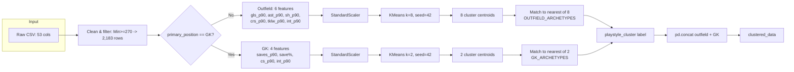
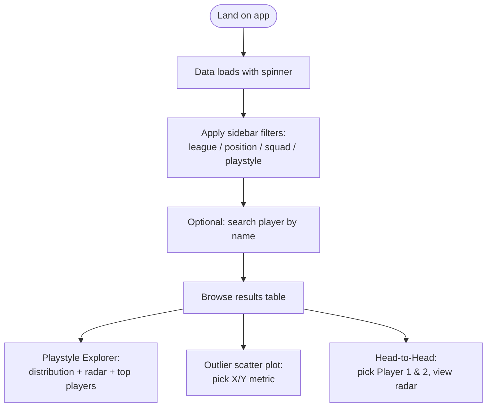

# ARCHITECTURE
### Football Playstyle Clustering App

Authority: subordinate to `PROJECT_CONSTITUTION.md`. This document is the single source of truth for *how the system is put together*. If code and this document disagree, treat that as a bug in whichever one is stale, and fix the document as part of the same change that touches the code (`PROJECT_CONSTITUTION.md §Definition of Done`).

---

## 1. Repository / Folder Structure (current, flat layout)

```
.
├── app.py                          # Streamlit entrypoint & UI orchestration
├── data_loader.py                  # CSV ingestion, cleaning, per-90 derivation
├── model_engine.py                 # Feature groups, archetypes, KMeans clustering, labeling, persistence
├── features.py                     # Filtering, percentiles, display formatting, stat catalogs
├── charts.py                       # Plotly figure builders (pure functions, no Streamlit calls)
├── statsbomb_parser.py             # v2: StatsBomb event parser → 44 event-derived features (P3+P6) + parse_lineups/position_v2
├── build_master_dataset.py         # v2: FBref + StatsBomb → data/wc2022_players_master.csv
├── v2_model_engine.py              # v2: headless position-scoped KMeans engine (P7) → models_v2/
├── v2_features.py                  # v2: app-facing layer (P9) — cached load, filter, percentiles, σ-radar data
├── scripts/
│   ├── download_statsbomb.py       # v2: fetch raw StatsBomb Open Data (gitignored target)
│   └── check_dataset.py            # v2: dataset sanity checks
├── data/                           # Dataset directory
│   ├── players_data_light-2025_2026.csv  # v1 legacy dataset (2,839 rows × 53 raw columns)
│   ├── wc2022_players_master.csv         # v2 master (217 rows × 192 cols, P3+P6 merged)
│   ├── wc2022_standard/shooting/miscellaneous/gk.csv  # v2 FBref inputs
│   └── statsbomb/                  # v2 raw Open Data JSON (gitignored; events/, lineups/, matches/)
├── tests/                          # pytest + conftest.py fixture, one file per module
│   ├── test_data_loader.py / test_model_engine.py / test_features.py / test_charts.py
│   ├── test_statsbomb_parser.py    # 52 parser tests, incl. locked P3 contract + P6 + position_v2
│   └── fixtures/statsbomb/events/match_fixture.json  # real-event parser fixture
├── models/                         # v1 Persisted ML artifacts (gitignored, created at runtime)
│   ├── outfield_scaler.joblib
│   ├── outfield_kmeans.joblib
│   ├── gk_scaler.joblib
│   ├── gk_kmeans.joblib
│   ├── cluster_labels.json
│   └── metadata.json
├── models_v2/                      # v2 Persisted artifacts (gitignored, created by v2_model_engine --persist)
│   ├── {GK,CB,FB_WB,MF,Wide,ST}_scaler.joblib / _kmeans.joblib
│   ├── cluster_labels_v2.json
│   └── metadata_v2.json
├── .github/workflows/ci.yml        # ruff check + pytest on push/PR to main
├── requirements.txt                # streamlit, pandas, scikit-learn, plotly, joblib
├── requirements-dev.txt            # pytest, ruff
└── README.md                       # Human-facing quickstart
```

There is **no `src/` package layout and no `config/` directory.** This is acceptable for the project's current size per `PROJECT_CONSTITUTION.md §11`. `tests/` and CI exist (see `TASK_BACKLOG.md` for backlog status).

> **Two parallel pipelines.** The v1 five-module app (above the `statsbomb_parser.py` line) is archived/legacy. The **v2 data pipeline** (`statsbomb_parser.py`, `build_master_dataset.py`, `scripts/`) builds the WC 2022 hybrid dataset, the **v2 clustering engine** (`v2_model_engine.py`, P7) clusters it headlessly, and the **v2 visualization layer** (`v2_features.py`, P9) wires it into `app.py` behind a sidebar dataset selector.

### Purpose of every file

| File | Responsibility | Imports from project | Imported by |
|---|---|---|---|
| `app.py` | Streamlit page config, sidebar filters, search, table, all chart sections, event wiring | `charts`, `features`, `model_engine` | — (entrypoint) |
| `data_loader.py` | `load_and_clean_data()`: read CSV, normalize columns, filter by minutes, derive `primary_position`, compute per-90 rates | — (no project imports) | `model_engine` |
| `model_engine.py` | Feature lists, archetype definitions, `group_players()`, `get_cluster_profiles()`, `get_clustered_data()` | `data_loader` | `app` |
| `features.py` | `FRIENDLY_NAMES`, `POSITION_COMPARE_STATS`, `EXPLORER_*_FEATURES`, percentile computation, filtering, table formatting | — (no project imports) | `app`, `charts` |
| `charts.py` | Pure Plotly figure builders — scatter, radar (H2H and playstyle), distribution bar | `features` (for `friendly_label`) | `app` |
| `statsbomb_parser.py` | v2: `parse_events()`/`iter_match_events()`/`parse_competition()` — raw StatsBomb events → 44 event-derived features per player (21 P3 + 23 P6); `parse_lineups()` — duration-weighted most-played position per player (`position_v2`) | — (no project imports; pure parser) | `build_master_dataset` |
| `build_master_dataset.py` | v2: FBref CSVs + StatsBomb features → `data/wc2022_players_master.csv`; `merge_statsbomb_event_features()`, `merge_position_v2()` | `statsbomb_parser` | — (CLI `__main__`) |
| `v2_model_engine.py` | v2: headless position-scoped KMeans engine — per-group `group_and_cluster()`, σ-offset archetype labeling, `models_v2/` persistence (SHA256-invalidated), CLI `--persist`/`--evaluate` | — (no project imports; copies v1 pure helpers verbatim) | — (CLI) |
| `v2_features.py` | v2: app-facing layer — cached `load_v2_clustered_data()`, `filter_v2_dataframe()`, position-scoped `add_v2_percentiles()`, `build_distribution_dataframe()`, `build_player_radar_data()` (σ-space) | `v2_model_engine` | `app` |
| `scripts/download_statsbomb.py` | v2: fetch raw StatsBomb Open Data (competition 43 / season 106) into `data/statsbomb/` | — (no project imports) | — (CLI) |

The **v2 modules** (`statsbomb_parser`, `build_master_dataset`, `v2_model_engine`) run headless; the **visualization layer** (`v2_features.py` + `app.py`'s v2 `render_*` functions, P9) is what brings the v2 engine into the app. See §11.

## 2. Module Dependency Graph

```mermaid
graph TD
    A[app.py] --> C[charts.py]
    A --> F[features.py]
    A --> M[model_engine.py]
    M --> D[data_loader.py]
    C --> F
    D -.reads.-> CSV[(players_data_light-2025_2026.csv)]

## 3. Data Flow (Cold Cache)

```mermaid
sequenceDiagram
    participant User
    participant App as app.py
    participant Model as model_engine.py
    participant Loader as data_loader.py
    participant CSV as players_data_light-2025_2026.csv

    User->>App: opens app
    App->>Model: get_clustered_data(filepath)  [st.cache_data]
    Model->>Loader: load_and_clean_data(filepath)  [st.cache_data]
    Loader->>CSV: pd.read_csv
    CSV-->>Loader: 2,839 raw rows, 53 columns
    Loader-->>Model: 2,183 rows (Min>=270) + primary_position + *_p90 columns
    Model->>Model: group_players(): split GK/outfield,<br/>StandardScaler + KMeans per group,<br/>match centroids to archetypes
    Model-->>App: clustered_data (+ playstyle_cluster)
    App->>App: rename playstyle_cluster -> Playstyle
    App->>App: features.add_position_percentiles()
    App->>App: add_unique_player_labels() [handles 152 duplicate names]
    App-->>User: render sidebar, table, explorer, scatter, H2H
```

On a **warm cache**, `app.py`'s `load_app_data()` (itself `@st.cache_data`) short-circuits the entire chain above and returns the cached DataFrame directly.

## 4. ML Pipeline (Detail)



Archetype matching (`_assign_labels_from_archetypes`) reuses the **player-level** `StandardScaler` fitted in `group_players` (the same `scaler_out` / `scaler_gk`), rather than fitting a separate scaler on the centroids alone. This anchors the archetype-matching distance metric to the real data distribution. Each cluster receives its true nearest archetype by Euclidean distance; if the best match exceeds a configurable threshold (default 3.5 standardized units), the cluster is labelled "Mixed Profile" instead — see `DECISIONS.md` (ADR-009) and `ML_GUIDELINES.md §3`.

The matching is **non-greedy and non-deduplicating**: multiple clusters can share the same archetype name if that is their true nearest match. This is more honest than the previous forced-unique greedy approach (pre-Option C).

## 5. User Flow



All four bottom sections (table, explorer, scatter, H2H) read from the **same** `filtered_df`, computed once per rerun in `app.py`'s module-level script body — Streamlit reruns the whole script top-to-bottom on every widget interaction, so `filtered_df` is always fresh but never redundantly recomputed within a single rerun.

## 6. State Management

- **No `st.session_state` is used anywhere in the codebase today.** All interactivity relies on Streamlit's default behavior: every widget interaction reruns `app.py` top to bottom, and widget values are read directly from their return values (e.g. `search_query = st.text_input(...)`).
- This is appropriate for the current feature set (no multi-step wizards, no cross-section dependent state) but will need to change if features like "save a comparison" or multi-page navigation are added — see `TASK_BACKLOG.md`.

## 7. Configuration

There is currently **no configuration file, environment variable, or CLI argument** anywhere in the project. All configuration is hardcoded:

| Value | Location | Meaning |
|---|---|---|
| `"data/players_data_light-2025_2026.csv"` | `app.py` (`load_app_data` call), `data_loader.py` / `model_engine.py` `__main__` blocks | Dataset filename (relative to project root) |
| `270` | `data_loader.load_and_clean_data` | Minimum minutes played to qualify |
| `8`, `2` | `model_engine.group_players` | K for outfield / GK KMeans (k=8 per Option C) |
| `42` | `model_engine.group_players` | Random seed |
| `OUTFIELD_ARCHETYPES`, `GK_ARCHETYPES` | `model_engine.py` | Hand-authored centroid targets for labeling |

This is flagged, not necessarily a defect at current scale — see `PERFORMANCE_GUIDE.md` and `TASK_BACKLOG.md` for when to promote these to a config module.

## 8. Caching Strategy

Three layers of `@st.cache_data`, each keyed implicitly by their arguments:

1. `data_loader.load_and_clean_data(filepath)`
2. `model_engine.get_clustered_data(filepath)` (calls #1 internally)
3. `app.load_app_data(filepath)` (calls #2 internally, then adds percentiles + labels)

Because all three are keyed only on a constant string filepath, cache invalidation in practice only happens on a code change (Streamlit hashes the function body) or a process restart — not on data change, since the CSV itself isn't hashed as an input. **Implication:** replacing the CSV file on disk without restarting the app will *not* invalidate the cache. This is worth knowing operationally; see `PERFORMANCE_GUIDE.md`.

**New (ML-03):** `model_engine._get_or_fit_model(filepath)` uses `@st.cache_resource` (not `@st.cache_data`) for the fitted `StandardScaler` + `KMeans` objects, since scikit-learn models are not JSON-serializable and `cache_resource` is designed for mutable objects with identity. The persistence layer (`models/` directory with `joblib` artifacts) provides an additional disk cache that survives process restarts — see `ML_GUIDELINES.md §11` and `PERFORMANCE_GUIDE.md §6`.

## 9. Processing Pipeline Summary (Textual)

`CSV → data_loader.load_and_clean_data → model_engine.group_players → app.load_app_data (rename + percentiles + unique labels) → features.filter_dataframe (per user filters) → app.apply_search_filter (per user search) → features.format_display_table / charts.build_*`

## 10. Removed: `fetch_possession_stats.py`

Removed during v1.0 cleanup. The file had been a standalone FBref scraper, deliberately disconnected from the app's import graph. If possession stats are revisited in v2, a new data-collection pipeline should follow the existing dataset pattern.

## 11. v2 Data Pipeline + Engine (WC 2022 Rebuild, P1–P9 complete)

The v2 pipeline builds `data/wc2022_players_master.csv` (217 rows × 192 cols) from hybrid FBref + StatsBomb sources, and `v2_model_engine.py` clusters it by position group. **P6 (position-scoped feature engineering + `position_v2`), P7 (position-scoped KMeans engine), P8 (bootstrap stability evaluation), and P9 (visualization + wiring into `app.py`) are complete.** P1–P5 landed at `59ef406`/`7ccb424`; P6–P7 merged to `main` at `caffe0e`; P8–P9 land on the `worktree-p8-bootstrap-stability` branch (2026-08-13).

```
data/statsbomb/ (raw Open Data, gitignored)
      │  scripts/download_statsbomb.py  (competition 43 / season 106, 64 matches)
      ▼
statsbomb_parser.py  → per-player 44 event-derived features (21 P3 + 23 P6)
      │               → parse_lineups(): per-player position_v2 (6 groups)
      ▼
build_master_dataset.py ── FBref CSVs ──► data/wc2022_players_master.csv
```

**P3 contract (locked, 21 columns):** 18 count features (`pressures_*`, `claims`, `sweeper_clearances`, `headed_clearances`, `recoveries`, `passes_received`, `one_touch_finishes`, `launch_passes`, `def_actions_outside_box`, `touches_*`, `final_third_entries`, `carries_into_box`, `headers`) normalized per-90 against FBref minutes; `avg_def_position_y` (mean GK defensive position); `cross_accuracy_pct` (completed/attempted ratio); `goals_prevented_p90` + `reflex_saves_p90` (authorized heuristics on linked-shot `statsbomb_xg`).

**P6 contract (additive, 23 columns):** passing (passes, progressive/long/key/through-ball/switches/into-final-third/into-box, completion), defending (clearances, blocks, aerial won, aerial duel %, duels won), shots (shots, xG, on-target, npxG-per-shot, headed goals), touches in box / final third, `shot_creating_actions_p90` (proxy = key passes), and GK-gated `penalty_save_pct`. All per-90 over FBref minutes unless raw. **Data fixes:** `conversion_pct` overflow guarded (`sh == 0 → 0.0`), `save_pct`/`shots_on_target_pct` guarded, `dribble_success_pct` added, `pkwon`/`pkcon` dropped (fully null).

**position_v2:** `parse_lineups()` computes each player's **duration-weighted most-played position** from StatsBomb lineup `positions[]` segments (final-whistle clock read from the match's events file, `max(minute*60+second)`), mapped to 6 groups (GK/CB/FB-WB/MF/Wide/ST). Real distribution for the 217 eligible players: **GK=28, CB=59, FB/WB=36, MF=55, Wide=21, ST=18**. `merge_position_v2()` writes `master["position_v2"]` via the shared identity bridge; the 4-way `position_group` column is untouched.

**position_detail (ADR-013):** `parse_lineups` also emits a finer display label via `POSITION_FINE_MAP` — MF→DM/CM/AM/LM/RM, Wide→LW/RW, FB/WB→LB/RB/LWB/RWB — used by the UI (table + sidebar filter), while clustering stays on the coarse `position_v2`. CB/ST/GK stay coarse. Real distribution: CB 59 · DM 32 · GK 28 · LB 19 · ST 18 · CM 16 · RB 13 · LW 12 · RW 9 · RM 4 · AM 3 · LWB 2 · RWB 2.

**P7 (position-scoped KMeans engine):** `v2_model_engine.py` is a **headless** engine (no streamlit in the import graph) that fits one KMeans per `position_v2` group on the P6 master — k = 2/3/3/5/3/3 (GK/CB/FB-WB/MF/Wide/ST), `random_state=42`, `n_init=10` — standardizes per group, and labels each cluster against the **20 σ-offset archetypes** (ST has 4 archetypes but k=3, so Poacher is retained-but-unpopulated — see ADR-011). `models_v2/` persists per-group scalers + KMeans, `cluster_labels_v2.json`, and `metadata_v2.json` (dataset SHA256, row/group counts, per-group features, library versions). CLI: `python v2_model_engine.py --persist` / `--evaluate`.

**P7 key design points:**
- **σ-offset archetype encoding:** `GROUP_ARCHETYPES` stores each archetype's traits as σ-above-group-mean offsets (Important traits +2.0–2.5σ, everything else 0.0σ = group mean), not raw units. `_archetype_vectors_raw` converts to raw units via the player-level scaler's `mean_`/`scale_`, so label distances are measured in group-standard-deviations — fixing the raw-unit hand-authored vectors that were 2–40σ off real centroids (root cause of the first fit labelling all 217 players "Mixed Profile").
- **Dimension-aware threshold:** `_label_threshold(n) = 3.5 · √(n / 6)` preserves v1's 3.5-at-6-features semantics as feature counts grow (a cluster off by ~1σ in ~12 dims exceeds √12 ≈ 3.5 — honest fallback, never forced).
- **Per-group fallback label (`GROUP_FALLBACK_LABEL`):** an over-threshold cluster gets its group's honest fallback — GK → **"Traditional Goalkeeper"** (2026-08-12 review-gate decision: the WC 2022 GK pool is homogeneous, 18/28 GKs land here and "Mixed Profile" was a poor output for 64% of a position; verified the quiet cluster is the stay-at-home keeper — below-mean on saves and every sweeping/distribution trait); other groups keep "Mixed Profile" for their rare (≤2) outliers.
- **`_artifact_stem`:** the `FB/WB` group name contains a `/`, so artifact filenames sanitize it (`FB_WB_scaler.joblib`); a naive `Path / "FB/WB_scaler.joblib"` would write into a non-existent `models_v2/FB/` directory and crash `--persist`.
- **Headless:** pure helpers (`_assign_labels_from_archetypes`, `evaluate_clustering`, `_compute_dataset_hash`) are copied verbatim from `model_engine.py` rather than imported, so the engine runs without Streamlit.

**P8 (bootstrap stability / refit-variance, 2026-08-12):** `--evaluate` now runs `evaluate_bootstrap_stability` per group after silhouette/DB — B=100 same-n bootstrap resamples (seeded from `RANDOM_STATE`; refit stream offset by B; no bare `random_state=None` per ML_GUIDELINES §10), each refits the group's exact production preprocessing (`fillna(0) → StandardScaler → KMeans(k, seeded, n_init=10)`) and predicts labels for **all original players**. Reports **mean ± std ARI** vs the deployed partition (bootstrap stability), mean ± std refit silhouette/DB (refit-variance), and the **degenerate fraction** (share of refits whose full-n prediction collapses to a ≤1-player cluster). Real-data snapshot: GK ARI 0.633±0.287 (degen 0.01) · CB 0.344±0.183 (0.06) · FB/WB 0.203±0.129 (0.17) · MF 0.354±0.142 (0.12) · Wide 0.304±0.152 (0.26) · ST 0.454±0.191 (0.39). Diagnostic-not-gating per ML_GUIDELINES §9 — the ST/Wide instability it exposes is evidence to act on, not a blocker. See DECISIONS.md ADR-010. **Follow-up (ADR-011, 2026-08-13):** ST k reduced 4→3 (Poacher retained-but-unpopulated) — ST ARI 0.454→0.526, degen 0.39→0.14; Wide remains the provisional small-n case.

**P9 (visualization + wiring into `app.py`, 2026-08-13):** a new app-facing module **`v2_features.py`** caches the v2 load (`load_v2_clustered_data` → `group_and_cluster`, fresh-fit to sidestep the stale-label caveat) and exposes v2 filtering, position-scoped percentiles, and σ-space radar data. `app.py` adds a **sidebar dataset selector** (`st.sidebar.radio`, v2 default) that branches to the v2 `render_*` sections (table, archetype distribution, playstyle explorer with a σ-radar vs the group's archetype prototype, position-scoped H2H) or falls through to the unchanged v1 body (guarded by `st.stop()`). `charts.py` gains `build_v2_distribution_chart` and `build_v2_archetype_radar_chart` (pure Plotly, no Streamlit). Unrepresented archetypes are surfaced in the UI rather than dropped, and duplicate labels are keyed on `(position_v2, cluster_id_v2)` — see ADR-012.

**Key design points:**
- **Two-pass parse** (`parse_events`): first pass indexes shots by event id so GK `related_events` resolve to linked shots.
- **Acting-team frame:** every event is in the acting team's frame (attacking goal at x=120). Zone boundaries (`FINAL_THIRD_X=80`, `BOX_X_MIN=102`, etc.) are module constants.
- **GK gating:** P3's 7 GK-scoped features and P6's `penalty_save_pct` are zero-filled for non-GKs in the merge (`pos_n == "GK"`).
- **Identity bridge:** StatsBomb `player_id` → `player.name` → `normalize_name()` → master `player_sb`, with squad disambiguation (`normalize_squad`); reused by `merge_position_v2` (raises on squad mismatch / double attach). Only one multi-variant player (Foden) exists, and he is not eligible.
- **Reproducible raw data:** `data/statsbomb/` is gitignored; `scripts/download_statsbomb.py` re-fetches it (64 matches).
- **Locked by tests:** `tests/test_statsbomb_parser.py` (52 tests) pins both contracts, zone boundaries, GK heuristics, merge gating, `position_v2` derivation, and — guarded on the real dataset — 217-row cardinality and the exact position distribution.
