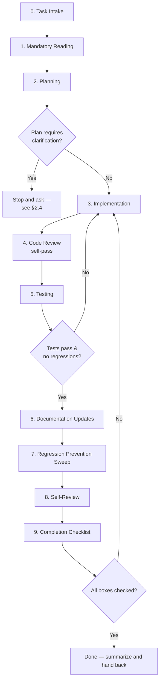

# DEVELOPMENT WORKFLOW
### Mandatory Standard Operating Procedure for AI Coding Agents

Authority: subordinate to `PROJECT_CONSTITUTION.md`, which this document turns into a concrete, ordered procedure. **This SOP applies uniformly to every AI coding agent** — Continue, Cursor, Claude Code, Cline, GitHub Copilot, GPT-based agents, and any future agent — regardless of which interface or model is doing the work. It also applies to human contributors, with the understanding that the explicit-documentation-reading steps exist primarily to compensate for an AI agent's lack of persistent memory between sessions.

No step in this workflow is optional. If a step seems unnecessary for a trivial change, the agent must still explicitly note *why* it was skipped or trivially satisfied — silent skipping is not permitted.

---

## 0. TL;DR — The Full Loop

---

## 1. How a Task Begins

Every task, regardless of size, starts the same way:

1. **Restate the task in your own words** before doing anything else — one or two sentences. If you cannot restate it accurately, you don't understand it yet; re-read the request or ask.
2. **Classify the task** against `PROJECT_CONSTITUTION.md §17` (Feature Complete scope) and `TASK_BACKLOG.md`:
   - Is this a bug fix? → find or create the relevant backlog entry.
   - Is this a new feature? → confirm it belongs in v1 scope or is explicitly requested as v2+ (out-of-scope items require a `DECISIONS.md` entry before implementation, per `PROJECT_SPEC.md §6`).
   - Is this a refactor? → confirm it is *not* bundled with a feature or bug fix (`PROJECT_CONSTITUTION.md §12`).
   - Is this a documentation-only change? → the reading requirements in §2 still apply, but §3–§5 (implementation/testing) are scoped to doc consistency, not code.
3. **Identify the owning module(s)** using `ARCHITECTURE.md §1`'s responsibility table before opening any file to edit. If the task appears to span more than 2-3 modules, treat that as a signal to slow down and re-check whether the task is actually well-scoped, or whether it should be split into sequential smaller tasks.

## 2. Mandatory Reading — In This Order

No code may be written before this reading is complete. Reading is proportional to the task, but the **minimum floor** below is never skipped.

### 2.1 Always read, every task, no exceptions
1. `PROJECT_CONSTITUTION.md` — if not already internalized this session, read in full. This is the one document that is never skimmed.
2. `AI_DEVELOPER_RULEBOOK.md` — the operating rules this workflow enforces.
3. `ARCHITECTURE.md` — to confirm which module(s) the task touches and how they connect to the rest of the system.

### 2.2 Read if the task touches the relevant area
| If the task touches... | Also read |
|---|---|
| `data_loader.py`, `model_engine.py`, or any feature/archetype definition | `ML_GUIDELINES.md`, and check `DECISIONS.md` for existing ADRs on that area (e.g. ADR-001 through ADR-005, ADR-007) |
| `app.py` or `charts.py` | `STREAMLIT_GUIDELINES.md` |
| Any function's structure, naming, error handling, or new dependency | `STYLE_GUIDE.md`, `SECURITY_GUIDE.md §7` (dependencies) |
| Anything expected to run on every rerun or cold start | `PERFORMANCE_GUIDE.md` |
| Any user input path (search, filters, future file upload) | `SECURITY_GUIDE.md` |
| Any bug fix or new logic of any kind | `TESTING_GUIDE.md` (a test is required — see §5) |

### 2.3 Always check before assuming something is a bug
- **`DECISIONS.md`** — search for an ADR covering the area. Several things that look like defects at first glance are documented, deliberate tradeoffs (e.g. `fillna(0)`-before-percentile in ADR-007, the greedy archetype-matching in ADR-002). Treat an undocumented "fix" of a decision recorded in `DECISIONS.md` as a process violation, not a helpful cleanup.
- **`TASK_BACKLOG.md`** — search for an existing entry (e.g. `ML-01`, `STYLE-01`). If found, work the task under its existing ID and acceptance criteria rather than reinventing scope.

### 2.4 Read the actual files you intend to change, in full
Not a grep excerpt, not a summary — the complete file. This codebase is small (5 core modules); there is no file in it too large to read fully before editing.

### 2.5 When reading surfaces ambiguity
If, after completing the reading above, the correct approach is still genuinely unclear (not just "requires a judgment call you're comfortable making"), **stop and ask** rather than guessing. `AI_DEVELOPER_RULEBOOK.md §5` lists the specific situations that always require asking (e.g. changing `random_state`, `n_clusters`, or the `Min >= 270` threshold; adding a dependency where an existing one suffices; ambiguity about which module owns new logic).

## 3. Planning Requirements

Before writing or editing a single line of code, produce a short, explicit plan and state it (in chat, in a PR description, or in whatever the agent's equivalent output channel is):

1. **Restated task** (from §1.1).
2. **Files to be touched**, and for each, the specific function(s) or section(s) within it — not "I will update `app.py`," but "I will add a new `render_*` function to `app.py` and a corresponding builder to `charts.py`."
3. **Files explicitly NOT to be touched**, if there's any risk of scope creep (e.g. "I noticed `filter_dataframe`'s unused `search_query` parameter — `STYLE-01` — but will not touch it as part of this change.").
4. **Relevant ADRs and backlog items** checked, with their IDs, per §2.3.
5. **Test plan**, stated before implementation: what new/updated tests will prove this change is correct, per `TESTING_GUIDE.md`.
6. **Documentation impact**: which `/docs` files will need updating as a result of this change (see §6).

A plan that cannot fill in items 2–6 concretely is not ready — go back to §2.

## 4. Implementation Requirements

- **Smallest correct diff.** One task, one concern. Never combine a refactor with a feature or bug fix (`PROJECT_CONSTITUTION.md §12`).
- **Respect module boundaries** exactly as mapped in `ARCHITECTURE.md §1` — data cleaning stays in `data_loader.py`, clustering stays in `model_engine.py`, filtering/percentiles/display formatting stay in `features.py`, chart construction stays in `charts.py`, orchestration/rendering stays in `app.py`.
- **Follow `STYLE_GUIDE.md`** for naming, imports, docstrings, error handling, and the forbidden-patterns list (no wildcard imports, no silent `except: pass`, no new global mutable state, no business logic inside `render_*` functions, etc.).
- **Follow `ML_GUIDELINES.md`** for any feature engineering, scaling, or clustering change — seeded, per-90 normalized, position-split, exactly as the existing pipeline does.
- **Follow `STREAMLIT_GUIDELINES.md`** for any UI change — correct section ordering, `st.divider()` placement, `plotly_dark` template, `width="stretch"`, friendly labels, and specific `st.info`/`st.warning`/`st.error` messaging for edge cases.
- **Never invent an API.** Every library call must be verifiable against actual usage elsewhere in the repo or the versions implied by `requirements.txt`.
- **Add new dependencies to `requirements.txt` in the same change** that introduces the import — never as an afterthought.
- **Preserve every existing guard clause and warning** (e.g. the `if gk_features and not df_gk.empty:` check in `group_players`, the GK-vs-outfield comparison warning in `render_h2h_section`) unless the task explicitly asks to change that behavior.

## 5. Testing Requirements

No change is complete without satisfying `TESTING_GUIDE.md`:

1. **New logic gets new tests.** Every new public function in `data_loader.py`, `model_engine.py`, or `features.py` needs at least one test; every new `build_*` function in `charts.py` needs at least a smoke test.
2. **Bug fixes get a regression test** that demonstrably fails against the pre-fix code and passes against the fix — write and run it against the old code first if at all possible, to prove it actually catches the bug.
3. **Clustering changes preserve determinism.** Any change touching `model_engine.py` must be checked against (or accompanied by, if it doesn't yet exist) the determinism test: running `group_players` twice on the same input produces identical `playstyle_cluster` labels. This is the single highest-priority test in the project per `TESTING_GUIDE.md §3`.
4. **Run the full existing test suite**, not just the new tests. All previously-passing tests must still pass.
5. **Run the manual smoke checks** if a full test suite isn't yet available for the touched area: `python data_loader.py` and `python model_engine.py` should still print `SUCCESS`.
6. If a genuinely untestable change is made (e.g. a pure documentation edit), state explicitly that testing requirements are not applicable and why — do not silently skip this section.

## 6. Documentation Update Requirements

Per `PROJECT_CONSTITUTION.md`'s Definition of Done, documentation updates are part of the change, not a follow-up:

| If the change... | Update... |
|---|---|
| Adds/removes/renames a module, changes the dependency graph, or changes data/UI/ML flow | `ARCHITECTURE.md` (including any affected Mermaid diagram) |
| Reverses, refines, or supersedes a previously-documented tradeoff | `DECISIONS.md` — append a new ADR; never edit a past one in place |
| Changes a coding convention, or establishes a new one | `STYLE_GUIDE.md` |
| Changes feature engineering, scaling, clustering parameters, or evaluation approach | `ML_GUIDELINES.md` |
| Changes UI layout, chart conventions, or interaction patterns | `STREAMLIT_GUIDELINES.md` |
| Changes caching, or introduces a new expensive operation | `PERFORMANCE_GUIDE.md` |
| Touches user input, file handling, or dependencies | `SECURITY_GUIDE.md` |
| Resolves, partially resolves, or newly discovers a tracked issue | `TASK_BACKLOG.md` — mark done or add a new entry with the same ID format |
| Changes any function's inputs, outputs, or behavior | That function's docstring, in the same change |

A change that should update one of the above but doesn't is **not done** — return to this step before proceeding to §9.

## 7. Regression Prevention

Before considering a change finished:

1. **Mentally trace every existing UI section** if `app.py`, `features.py`, `model_engine.py`, or `charts.py` was touched: sidebar filters → search → table → Playstyle Explorer → scatter plot → head-to-head. Confirm each still functions with the change applied — state explicitly which of these you traced and how (running the app, reading the call chain, or both).
2. **Check the known traps list** in `AI_DEVELOPER_RULEBOOK.md §3` (e.g. `get_cluster_profiles`'s `playstyle_col` default differs from what `app.py` actually passes; `primary_position` is derived defensively in two places; `OUTFIELD_FEATURES` and `EXPLORER_OUTFIELD_FEATURES` are separate constants that happen to currently match). Confirm the change doesn't silently break one of these documented subtleties.
3. **Diff review against the plan from §3**: does the actual diff match what was planned, with no unplanned side effects introduced along the way?
4. **Re-run the full test suite** (§5.4) as the final regression gate, not just the tests for the new logic.

## 8. Self-Review

Before handing the change back:

1. **Read the diff as the reviewer, not the author.** For every changed line, ask "why is this here" — if you can't answer without re-deriving it from scratch, the change needs a comment or a docstring, not just an explanation in your head.
2. **Run through `CODE_REVIEW_CHECKLIST.md` in full**, checking every applicable box (Architecture, Naming, Performance, Bug, Security, Testing, Documentation, and the conditional ML/UI sections). This is not optional and is not satisfied by having "generally followed the guides" — go through the literal checklist.
3. **Confirm the diff is the smallest correct change** — no unrelated fixes, no unrelated refactors, no scope creep beyond what was stated in the plan.

## 9. Completion Checklist

A task is only complete when every box below is genuinely checked, not assumed:

- [ ] Task restated and classified correctly (§1).
- [ ] Mandatory reading completed, including relevant `DECISIONS.md`/`TASK_BACKLOG.md` checks (§2).
- [ ] Plan stated explicitly before implementation, including files touched, files deliberately not touched, and test plan (§3).
- [ ] Implementation respects module boundaries and follows all applicable standards docs (§4).
- [ ] New/changed logic has new/updated tests; regression test added for any bug fix; full suite passes (§5).
- [ ] Every documentation file affected per the table in §6 has been updated in this same change.
- [ ] Regression sweep completed: existing UI sections traced, known traps checked, diff matches plan (§7).
- [ ] `CODE_REVIEW_CHECKLIST.md` run in full, all applicable boxes checked (§8).
- [ ] Final summary written in plain language: what changed, why, what was verified and how, what (if anything) was deliberately left alone, and any open questions or follow-up items filed in `TASK_BACKLOG.md`.

**Only once every box above is checked may the agent report the task as done.** A task with any unchecked box is still in progress, regardless of how much work has been completed.

---

## 10. Escalation

If at any point in this workflow — reading, planning, implementation, testing, or review — the correct path is genuinely unclear rather than merely requiring a reasonable judgment call, stop and surface the question rather than proceeding on an assumption. It is always preferable to pause and ask than to ship a confidently-wrong change; `PROJECT_CONSTITUTION.md §18` and `AI_DEVELOPER_RULEBOOK.md §5` govern exactly when this applies.
