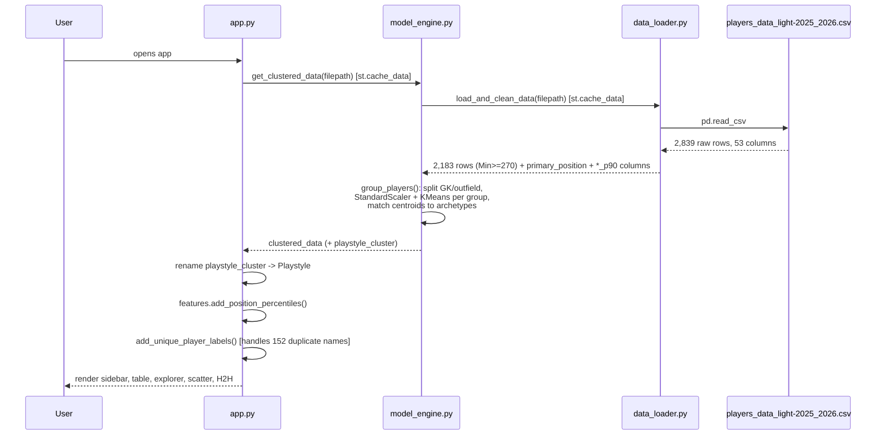
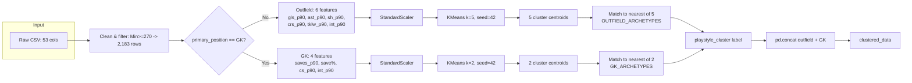
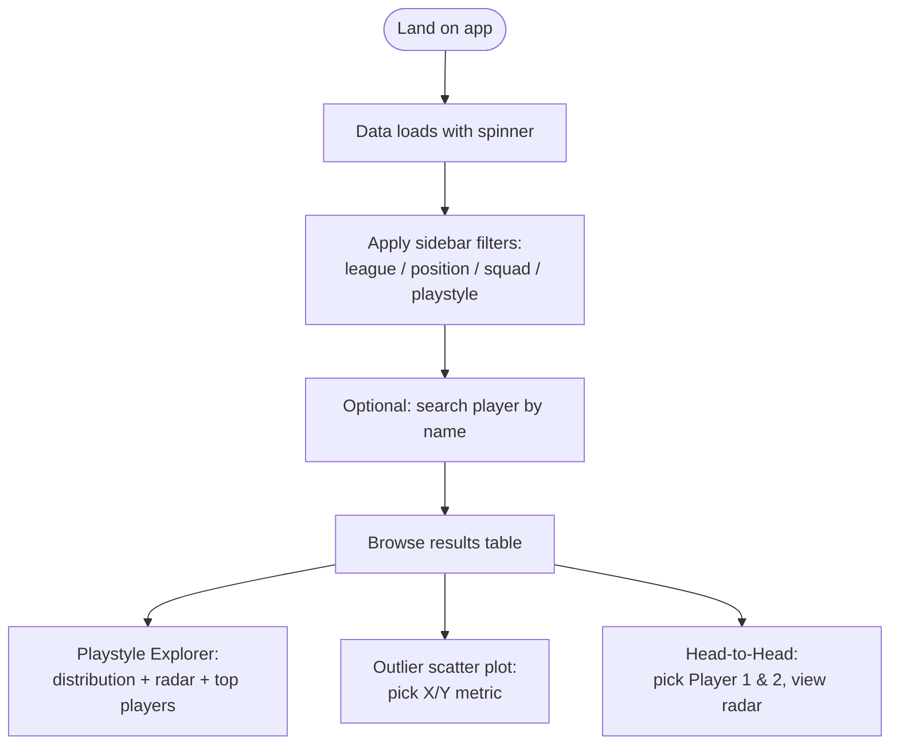

# ARCHITECTURE
### Football Playstyle Clustering App

Authority: subordinate to `PROJECT_CONSTITUTION.md`. This document is the single source of truth for *how the system is put together*. If code and this document disagree, treat that as a bug in whichever one is stale, and fix the document as part of the same change that touches the code (`PROJECT_CONSTITUTION.md §Definition of Done`).

---

## 1. Repository / Folder Structure (current, flat layout)

```
.
├── app.py                          # Streamlit entrypoint & UI orchestration
├── data_loader.py                  # CSV ingestion, cleaning, per-90 derivation
├── model_engine.py                 # Feature groups, archetypes, KMeans clustering, labeling
├── features.py                     # Filtering, percentiles, display formatting, stat catalogs
├── charts.py                       # Plotly figure builders (pure functions, no Streamlit calls)
├── fetch_possession_stats.py       # Standalone/manual FBref scraper — NOT imported by the app
├── players_data_light-2025_2026.csv# Bundled dataset (2,839 rows × 53 raw columns)
├── requirements.txt                # streamlit, pandas, scikit-learn, plotly
└── README.md                       # Human-facing quickstart
```

There is currently **no `src/` package layout, no `tests/` directory, and no `config/` directory.** This is acceptable for the project's current size (5 top-level modules) per `PROJECT_CONSTITUTION.md §11`, but is flagged in `TASK_BACKLOG.md` as the project grows past this size.

### Purpose of every file

| File | Responsibility | Imports from project | Imported by |
|---|---|---|---|
| `app.py` | Streamlit page config, sidebar filters, search, table, all chart sections, event wiring | `charts`, `features`, `model_engine` | — (entrypoint) |
| `data_loader.py` | `load_and_clean_data()`: read CSV, normalize columns, filter by minutes, derive `primary_position`, compute per-90 rates | — (no project imports) | `model_engine` |
| `model_engine.py` | Feature lists, archetype definitions, `group_players()`, `get_cluster_profiles()`, `get_clustered_data()` | `data_loader` | `app` |
| `features.py` | `FRIENDLY_NAMES`, `POSITION_COMPARE_STATS`, `EXPLORER_*_FEATURES`, percentile computation, filtering, table formatting | — (no project imports) | `app`, `charts` |
| `charts.py` | Pure Plotly figure builders — scatter, radar (H2H and playstyle), distribution bar | `features` (for `friendly_label`) | `app` |
| `fetch_possession_stats.py` | Manual scraper for FBref possession stats → local CSV | — | — (standalone; not part of the app's import graph) |

## 2. Module Dependency Graph

```mermaid
graph TD
    A[app.py] --> C[charts.py]
    A --> F[features.py]
    A --> M[model_engine.py]
    M --> D[data_loader.py]
    C --> F
    D -.reads.-> CSV[(players_data_light-2025_2026.csv)]
    FP[fetch_possession_stats.py] -.scrapes.-> FBREF[(fbref.com)]
    FP -.writes.-> OUT[(fbref_possession_2025_2026.csv)]

    style FP fill:#333,stroke:#999,stroke-dasharray: 5 5
    style OUT fill:#333,stroke:#999,stroke-dasharray: 5 5
```



`fetch_possession_stats.py` is drawn disconnected deliberately: it does not participate in the runtime import graph of the Streamlit app. See `DECISIONS.md` for the reasoning and its intended future.

## 3. Data Flow (Cold Cache)



On a **warm cache**, `app.py`'s `load_app_data()` (itself `@st.cache_data`) short-circuits the entire chain above and returns the cached DataFrame directly.

## 4. ML Pipeline (Detail)



Archetype matching (`_assign_labels_from_archetypes`) is a **second, independent** `StandardScaler`, fit only on the 5 (or 2) cluster centroids, then applied to the hand-authored archetype vectors, then greedily nearest-matched with de-duplication (`used_names`). This is a deliberate design choice with a known statistical caveat — see `ML_GUIDELINES.md §Archetype Matching` and `DECISIONS.md`.

## 5. User Flow



All four bottom sections (table, explorer, scatter, H2H) read from the **same** `filtered_df`, computed once per rerun in `app.py`'s module-level script body — Streamlit reruns the whole script top-to-bottom on every widget interaction, so `filtered_df` is always fresh but never redundantly recomputed within a single rerun.

## 6. State Management

- **No `st.session_state` is used anywhere in the codebase today.** All interactivity relies on Streamlit's default behavior: every widget interaction reruns `app.py` top to bottom, and widget values are read directly from their return values (e.g. `search_query = st.text_input(...)`).
- This is appropriate for the current feature set (no multi-step wizards, no cross-section dependent state) but will need to change if features like "save a comparison" or multi-page navigation are added — see `TASK_BACKLOG.md`.

## 7. Configuration

There is currently **no configuration file, environment variable, or CLI argument** anywhere in the project. All configuration is hardcoded:

| Value | Location | Meaning |
|---|---|---|
| `"players_data_light-2025_2026.csv"` | `app.py` (`load_app_data` call), `data_loader.py` / `model_engine.py` `__main__` blocks | Dataset filename |
| `270` | `data_loader.load_and_clean_data` | Minimum minutes played to qualify |
| `5`, `2` | `model_engine.group_players` | K for outfield / GK KMeans |
| `42` | `model_engine.group_players` | Random seed |
| `OUTFIELD_ARCHETYPES`, `GK_ARCHETYPES` | `model_engine.py` | Hand-authored centroid targets for labeling |

This is flagged, not necessarily a defect at current scale — see `PERFORMANCE_GUIDE.md` and `TASK_BACKLOG.md` for when to promote these to a config module.

## 8. Caching Strategy

Three layers of `@st.cache_data`, each keyed implicitly by their arguments:

1. `data_loader.load_and_clean_data(filepath)`
2. `model_engine.get_clustered_data(filepath)` (calls #1 internally)
3. `app.load_app_data(filepath)` (calls #2 internally, then adds percentiles + labels)

Because all three are keyed only on a constant string filepath, cache invalidation in practice only happens on a code change (Streamlit hashes the function body) or a process restart — not on data change, since the CSV itself isn't hashed as an input. **Implication:** replacing the CSV file on disk without restarting the app will *not* invalidate the cache. This is worth knowing operationally; see `PERFORMANCE_GUIDE.md`.

## 9. Processing Pipeline Summary (Textual)

`CSV → data_loader.load_and_clean_data → model_engine.group_players → app.load_app_data (rename + percentiles + unique labels) → features.filter_dataframe (per user filters) → app.apply_search_filter (per user search) → features.format_display_table / charts.build_*`

## 10. Non-Runtime Component: `fetch_possession_stats.py`

A manually-run scraper against `fbref.com`'s Big-5 possession table. It is architecturally **out-of-band**: it has its own dependency footprint (`requests`, `beautifulsoup4`, `lxml` — none of which are in `requirements.txt`, correctly, since it is not part of the deployed app) and its output (`fbref_possession_2025_2026.csv`) is not read by any other module. Treat it as the seed of a future ingestion pipeline, not as dead code to delete — see `DECISIONS.md`.
